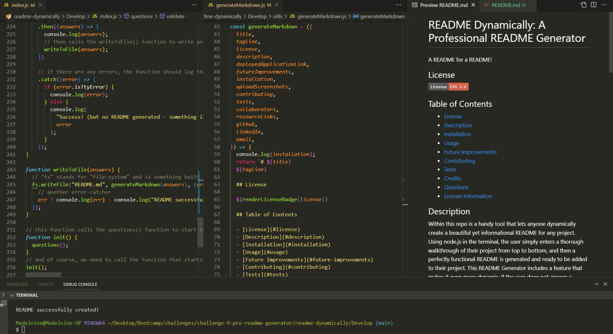

# README Dynamically: A Professional README Generator
  A README for a README!
  
  ## License
  
  
  
  ## Table of Contents
  
  - [License](#license)
  - [Description](#description)
  - [Deployed Application](#deployed-application)
  - [Future Improvements](#future-improvements)
  - [Installation](#installation)
  - [Usage](#usage)
  - [Contributing](#contributing)
  - [Tests](#tests)
  
  - [Questions](#questions)
  - [License Information](#license-information)

  ## Description
  
  Within this repo is a handy tool that lets anyone dynamically create a beautiful yet informational README for any project. Using node.js in the terminal, the user simply enters a thorough walkthrough of their project from top to bottom, and then a perfectly functional README is generated and ready to be added to their project. This README Generator includes a feature that makes it even more dynamic. If the user does not answer a question, the heading for that section in the README will be omitted, creating a less cluttered and more efficient README. The Table of Contents is also dynamically adjusted to omit the corresponding section. This feature only applies to certain sections, as some will be needed for the majority of any user's projects.
  
  ## Deployed Application
     This challenge does not include a deployed application. Instead, a screen-recorded video is submitted alongside the Github repo link.

  ## Future Improvements
      * 1 - Validation: I received help from a TA in class to use Regex for validating the user input email and URL. For the most part, I got the validation to work, but for the URL I couldn't quite get the Regex code to check for github.com or linkedin.com specifically, just that it contained "http" or "https." 2 - Spacing: When I added the ternary operators to the section headers and table of contents section within the generateMarkdown() function, I noticed that some of the spacing is off when the README generated. The spacing issue doesn't show as much in the README preview, though, which is good. 3 - Strange misspellings? When screen-recording my project, I pasted multiple lines of text from my sample README into the terminal to answer each question quickly in the video. I noticed that in the generated README, some words were missing letters and those letters would appear later on. It seems to be a bug within the integrated terminal in VSCode. Curiously, it did not give me misspellings when running the app through Gitbash. 4 - Licenses: Add an option for no license

  ## Installation
     To operate this app, follow these instructions: 1] Fork this repository to create a copy in your own Github 2] Clone it down to your computer with either the SSH key (if you have that set up, or the HTTPS link) 3] Open your computer's version of the terminal (GitBash, iTerm, etc.) 4] Within the terminal, navigate (cd) into the new local repo you have just created 5] Enter "npm install" or "npm i" in the terminal to install the necessary node modules for this project 6] Enter "node index.js" to run the app. 7] The app should ask you a series of questions about your project, then create a README for you to take with you!
 
  ## Usage

  Below are screenshots of the README Dynamically: A Professional README Generator:
  

  ## Contributing
     Thanks for contributing! Instructions to do so are detailed here: This project is currently not open for contributions
  
  ## Tests
     No tests applicable to this project at this time
  
  ## Credits
     Collaborators: GA Tech Bootcamp Class Dec '22
  
  List of resources used: 
     https://coding-boot-camp.github.io/full-stack/github/professional-readme-guide
  
  ## Questions

  Any questions? I'd love to hear from you!
  Contact me at:
  https://github.com/example,
  https://linkedin.com/example,
  or good old fashioned email x@example.com.

  ## License Information

  Click on the license badge for more information about that license 
  
  ---